## Material Design Widgets - Lightweight
This framework give you full flexibility to apply any material design widget you would like to use in your app! Please see below steps if you only need to use one or two of the entire package widgets. 

[](https://shields.io/) [](https://shields.io/)  [](https://shields.io/) [](https://shields.io/) [
](https://shields.io/) 

| Light mode |  Dark mode |
|:--:| :--:|
| 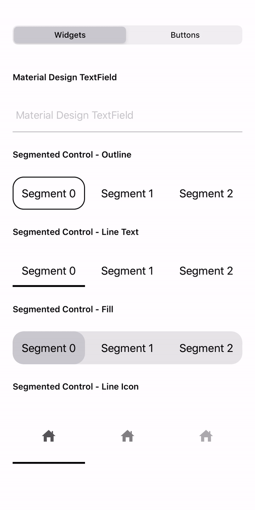 | 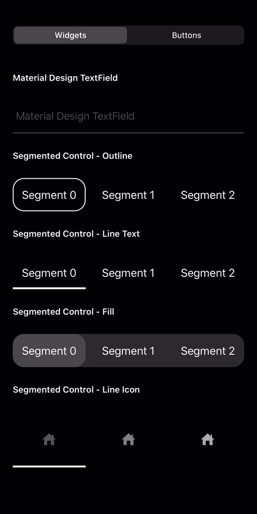  | 

You may download **MaterialDesignWidgetsDemo** to see how its used in your app. 

## Key Features
- A full package of material design widgets that you'll need to upgrade your app's visual.
- Widget classes are made to be **open**, which gives you flexibility to create your own.
- Instead of pull down the entire package, you can also copy the source of any widget you need independently.
- If you decide to just use one of the widgets, you can follow below **usage** for instructions on which files you need for that specific widget.

## Requirements
- Swift 5.0
- iOS 11.0+

## Installation

MaterialDesignWidgets is available through [CocoaPods](http://cocoapods.org). To install
it, simply add the following line to your Podfile:

```
$ pod 'MaterialDesignWidgets'
```

If you don't use CocoaPods, you can download the entire project then drag and drop all the classes and use them in your project.

## Usage

### Buttons
> Required Files:
> - **RippleLayer.swift**
> - **MaterialButton.swift**

#### Normal Button
```swift
let btnSample1 = MaterialButton(text: "Sample1", cornerRadius: 15.0)
let btnSample2 = MaterialButton(text: "Sample2", textColor: .black, bgColor: .white)
```
| Light mode |  Dark mode |
|:--:| :--:|
| 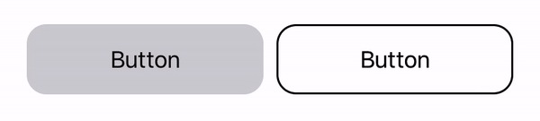 | 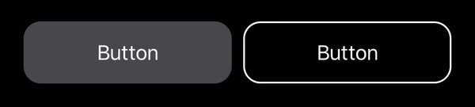 | 

#### Loading Button
```swift
let btnLoading = MaterialButton(text: "Loading Button", cornerRadius: 15.0)
loadingBtn.addTarget(self, action: #selector(tapLoadingButton(sender:)), for: .touchUpInside)

@objc func tapLoadingButton(sender: MaterialButton) {
    sender.isLoading = !sender.isLoading
    sender.isLoading ? sender.showLoader(userInteraction: true) : sender.hideLoader()
}
```
| Light mode |  Dark mode |
|:--:| :--:|
| 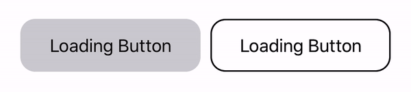 | 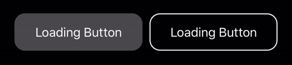 | 

#### Shadow Button
```swift
let btnShadow = MaterialButton(text: "Shadow Button", cornerRadius: 15.0, withShadow: true)
```
| Light mode |  Dark mode |
|:--:| :--:|
| 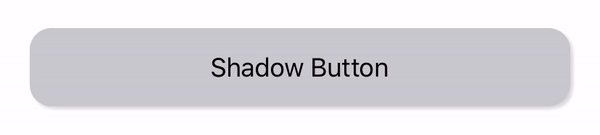 | 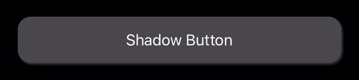 | 

#### Vertical Aligned Button
```swift
let img = UIImage(named: "Your image name")
let btnV = MaterialVerticalButton(icon: img, title: "Fill", foregroundColor: .black, bgColor: .white)
```
| Light mode |  Dark mode |
|:--:| :--:|
|  | 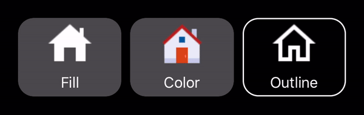 | 

### Segmented Control
>  Required File - **MaterialSegmentedControl.swift**

#### Filled
```swift
let sgFilled = MaterialSegmentedControl(selectorStyle: .fill, fgColor: .black, selectedFgColor: .white, selectorColor: .black, bgColor: .lightGray)
// Below is styling, you can write your own.
sgFilled.backgroundColor = .lightGray
sgFilled.setCornerBorder(cornerRadius: 18.0)
```
| Light mode |  Dark mode |
|:--:| :--:|
| 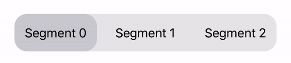 | 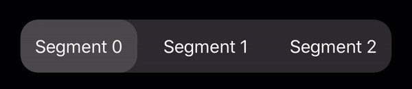 | 

#### Outline
```swift
let sgOutline = MaterialSegmentedControl(selectorStyle: .outline, fgColor: .black, selectedFgColor: .black, selectorColor: .black, bgColor: .white)
```
| Light mode |  Dark mode |
|:--:| :--:|
| 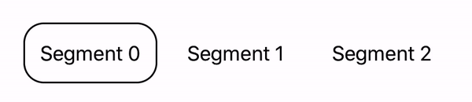 | 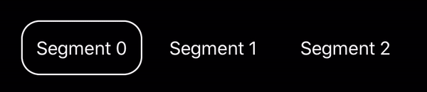 | 

#### Line Text
```swift
let sgLine = MaterialSegmentedControl(selectorStyle: .line, fgColor: .black, selectedFgColor: .black, selectorColor: .black, bgColor: .white)
```
| Light mode |  Dark mode |
|:--:| :--:|
| 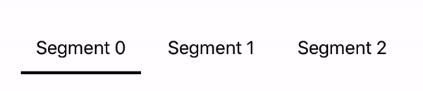 | 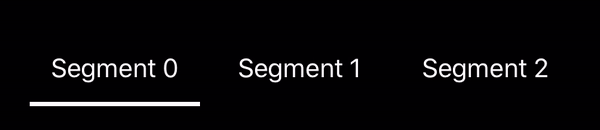 | 

#### Line Icon
```swift
let sgLineIcon = MaterialSegmentedControl(selectorStyle: .line, fgColor: .black, selectedFgColor: .black, selectorColor: .gray, bgColor: .white)
```
| Light mode |  Dark mode |
|:--:| :--:|
| 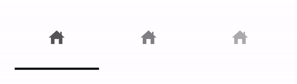 | 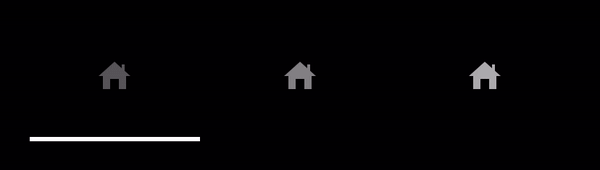 | 

#### Append Normal Segment
```swift
for i in 0..<3 {
    segCtrl.appendSegment(text: "Segment \(i)", textColor: .gray, bgColor: .clear, cornerRadius: radius)
}
```

#### Append Icon Segment
```swift
let icons = [yourImage1, yourImage2, yourImage3]
for i in 0..<3 {
    sgLineIcon.appendIconSegment(icon: icons[i], preserveIconColor: true, rippleColor: .clear, cornerRadius: 0.0)
}
```

#### Add Value Change Listener
```swift
segCtrl.addTarget(self, action: #selector(yourSegmentedControlValueChangeMethod), for: .valueChanged)
```

### TextField
> Required files:
> - **RippleLayer.swift**
> - **MaterialTextField.swift**
```swift
let textField = MaterialTextField(hint: "TextField", textColor: .black, bgColor: .white)
```
| Light mode |  Dark mode |
|:--:| :--:|
| 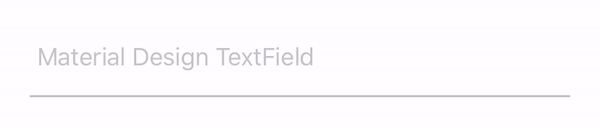 | 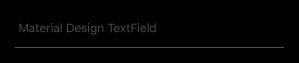 | 

### Loading Indicator
> Required file - **MaterialLoadingIndicator.swift**
```swift
let indicatorBlack = MaterialLoadingIndicator(radius: 15.0, color: .black)
indicatorBlack.startAnimating()
let indicatorGray = MaterialLoadingIndicator(radius: 15.0, color: .gray)
indicatorGray.startAnimating()
```
| Light mode |  Dark mode |
|:--:| :--:|
|  |  | 

## Credits
* [Material Design](https://material.io/design/)
* [Le Van Nghia](https://github.com/sharad-paghadal/MaterialKit/tree/master/Source)
* [Icons8](https://icons8.com/)
